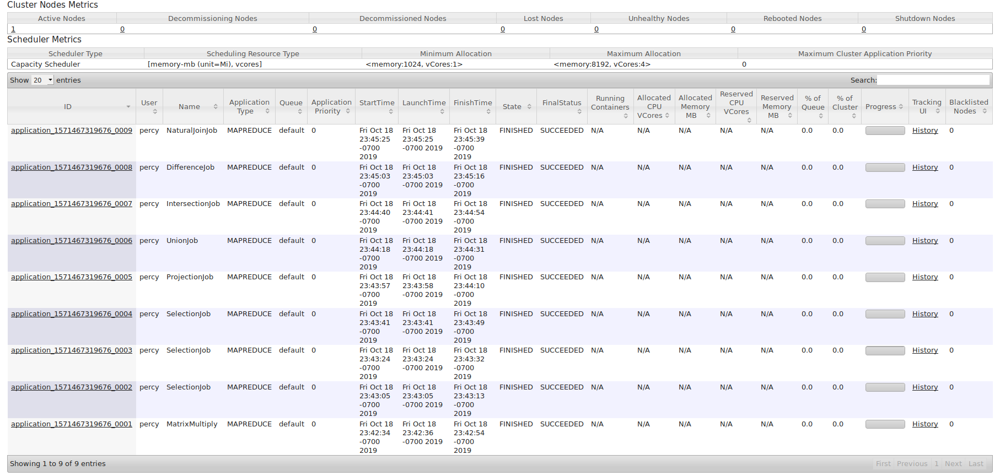

# Hadoop MapReduce Programming

### Notice

1. I have changed the contents of Ra1 by deleting the last five entries. I am doing this because the initial Ra and Ra1 are the same, and cannot fully illustrate Union, Intersection and Difference.
2. Terminal screen captures do not contain enough information, so a screen capture of YARN's interface is provided to prove I've run these programs.
3. All my terminal commands are written in shell scripts in directory sbin.

### Screen capture

<left>
    
</left>

### Matrix Multiply

```shell
Usage: MatrixMultiply <Matrix M> <Matrix N> <Output directory>
```

Links:

- [Source Code](https://github.com/PerseusW/Hadoop/blob/master/171860611-王麦迪-作业4/code/MatrixMultiply.java)
- [Run Result](https://github.com/PerseusW/Hadoop/blob/master/171860611-王麦迪-作业4/ans/MatrixMultiply)

### Selection

```shell
Usage: Selection <Input file> <Output file> <Column id> [s | g]<Value>
```

Links:

- [Source Code](https://github.com/PerseusW/Hadoop/blob/master/171860611-王麦迪-作业4/code/Selection.java)
- [Run Result1](https://github.com/PerseusW/Hadoop/blob/master/171860611-王麦迪-作业4/ans/Selection1)
- [Run Result2](https://github.com/PerseusW/Hadoop/blob/master/171860611-王麦迪-作业4/ans/Selection2)
- [Run Result3](https://github.com/PerseusW/Hadoop/blob/master/171860611-王麦迪-作业4/ans/Selection3)

### Projection

```shell
Usage: Projection <Input file> <Output file> <Column id>
```

Links:

- [Source Code](https://github.com/PerseusW/Hadoop/blob/master/171860611-王麦迪-作业4/code/Projection.java)
- [Run Result](https://github.com/PerseusW/Hadoop/blob/master/171860611-王麦迪-作业4/ans/Projection)

### Union

```shell
Usage: Union <Input directory> <Output file>
```

Links:

- [Source Code](https://github.com/PerseusW/Hadoop/blob/master/171860611-王麦迪-作业4/code/Union.java)
- [Run Result](https://github.com/PerseusW/Hadoop/blob/master/171860611-王麦迪-作业4/ans/Union)

### Intersection

```shell
Usage: Intersection <Input directory> <Output file>
```

Links:

- [Source Code](https://github.com/PerseusW/Hadoop/blob/master/171860611-王麦迪-作业4/code/Intersection.java)
- [Run Result](https://github.com/PerseusW/Hadoop/blob/master/171860611-王麦迪-作业4/ans/Intersection)

### Difference

```shell
Usage: Difference <Input directory> <Output file> <File differenced>
```

Links:

- [Source Code](https://github.com/PerseusW/Hadoop/blob/master/171860611-王麦迪-作业4/code/Difference.java)
- [Run Result](https://github.com/PerseusW/Hadoop/blob/master/171860611-王麦迪-作业4/ans/Difference)

### NaturalJoin

```shell
Usage: NaturalJoin <Input file> <Input file> <Output file>
```

Links:

- [Source Code](https://github.com/PerseusW/Hadoop/blob/master/171860611-王麦迪-作业4/code/NaturalJoin.java)
- [Run Result](https://github.com/PerseusW/Hadoop/blob/master/171860611-王麦迪-作业4/ans/NaturalJoin)

