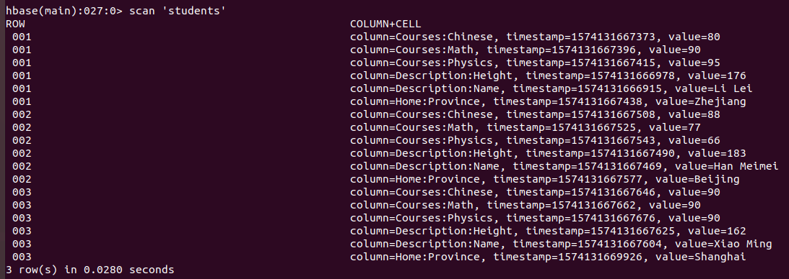

# Homework 6: HBase

This is the intellectual property of **171860611, 王麦迪**.

Homework requirements:

1. Download and install `HBase`. Try standalone mode, pseudo-distributed mode, distributed mode(optional).
2. Familiarize `HBase Shell`.
3. Run `HBase` in pseudo-distributed mode. Write a java program to create the student table in Class.

## 1 Installation

### 1.1 Download

Download the stable release of HBase via [Tsinghua Mirror](https://mirrors.tuna.tsinghua.edu.cn/apache/hbase/stable/).

### 1.2 Extract

```shell
tar -xzvf hbase-1.4.11-bin.tar.gz
sudo mv hbase-1.4.11 /usr/local/hbase
```

### 1.3 Configure

#### 1.3.1 JAVA_HOME

```shell
gedit /usr/local/hbase/conf/hbase-env.sh
```

Append the following line in the file:

```bash
export JAVA_HOME=/usr/local/java
```

#### 1.3.2 Pseudo Distributed Mode

```shell
gedit /usr/local/hbase/conf/hbase-site.xml 
```

Overwrite with the following configuration:

```xml
<configuration>
    <property>
        <name>hbase.cluster.distributed</name>
        <value>true</value>
    </property>

    <property>
        <name>hbase.rootdir</name>
        <value>hdfs://localhost:9000/hbase</value>
        <description>It should be on the same port as HDFS</description>
    </property>
</configuration>
```

## 2 Shell Test

| ID   | Description |        | Courses |      |         | Home     |
| ---- | ----------- | ------ | ------- | ---- | ------- | -------- |
|      | Name        | Height | Chinese | Math | Physics | Province |
| 001  | Li Lei      | 176    | 80      | 90   | 95      | Zhejiang |
| 002  | Han Meimei  | 183    | 88      | 77   | 66      | Beijing  |
| 003  | Xiao Ming   | 162    | 90      | 90   | 90      | Shanghai |

```sql
create 'students', 'ID', 'Description', 'Courses', 'Home'

put 'students', '001', 'Description:Name', 'Li Lei'
put 'students', '001', 'Description:Height', '176'
put 'students', '001', 'Courses:Chinese', '80'
put 'students', '001', 'Courses:Math', '90'
put 'students', '001', 'Courses:Physics', '95'
put 'students', '001', 'Home:Province', 'Zhejiang'

put 'students', '002', 'Description:Name', 'Han Meimei'
put 'students', '002', 'Description:Height', '183'
put 'students', '002', 'Courses:Chinese', '88'
put 'students', '002', 'Courses:Math', '77'
put 'students', '002', 'Courses:Physics', '66'
put 'students', '002', 'Home:Province', 'Beijing'

put 'students', '003', 'Description:Name', 'Xiao Ming'
put 'students', '003', 'Description:Height', '162'
put 'students', '003', 'Courses:Chinese', '90'
put 'students', '003', 'Courses:Math', '90'
put 'students', '003', 'Courses:Physics', '90'
put 'students', '003', 'Home:Province', 'Shanghai'

scan 'students'
```

<center>
    
</center>

## 3 Java API

