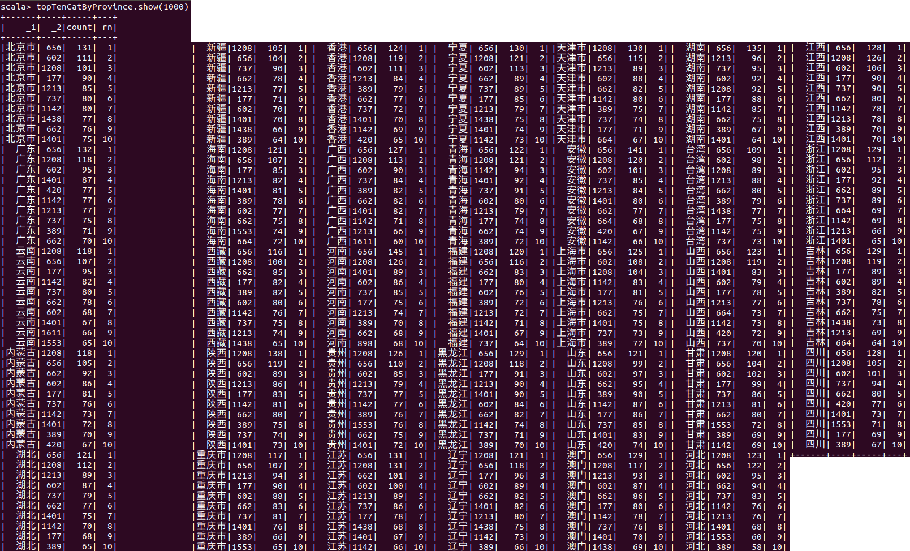
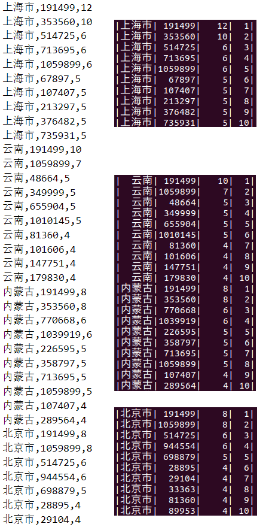
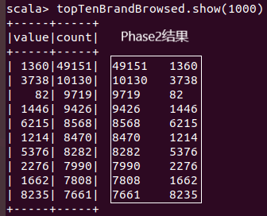

# 阶段三 实验报告

该报告是**171860611，王麦迪**的工作成果。

## 环境配置

由于老师允许Standalone模式的配置，后续Spark相关的实验配置都将使用最简Standalone配置。

```shell
tar -xzvf jdk-8u221-linux-x64.tar.gz
sudo mv jdk1.8.0_221 /usr/local/java

tar -xzvf scala-2.13.1.tgz
sudo mv scala-2.13.1 /usr/local/scala

tar -xzvf spark-2.4.4-bin-hadoop2.7.tgz
sudo mv spark-2.4.4-bin-hadoop2.7 /usr/local/spark
```

```shell
export JAVA_HOME=/usr/local/java
export PATH=$PATH:/usr/local/java/bin:/usr/local/scala/bin:/usr/local/spark/bin
```

```shell
java -version
scala -version
spark-shell
```

至此，我们已经进入了`Spark Shell`，剩下的实验工作都在该环境下完成。

## 实验过程

该实验主要使用Scala语言。

### 需求分析

原始需求：

> 基于精简数据集完成Spark作业：
>
> ​	统计各省销售最好的产品类别前十（销售最多前10的产品类别）
>
> ​	统计各省的双十一前十热门销售产品（购买最多前10的产品）-- 和MapReduce作业对比结果
>
> ​	查询双11那天浏览次数前十的品牌 -- 和Hive作业对比结果

开发需求：

- 任务一
  - 筛选action = 2的元组
  - 按照province分组
  - 统计categoryID出现的次数
  - 按照次数降序排序
  - 选择前10

- 任务二
  - 筛选出action = 2的元组
  - 按照province分组
  - 统计itemID出现的次数
  - 按照次数降序排序
  - 选择前10

- 任务三
  - 筛选action = 0的元组
  - 统计元组数量
  - 按照数量降序排序
  - 选择前10

### 编码实现

```scala
import spark.implicits._
import scala.util.Try
import org.apache.spark.sql.expressions.Window

case class UserLog(val userID: Int, val itemID: Int, val catID: Int, val merchantID: Int, val brandID: Int, val month: Int, val day: Int, val action: Int, val ageRange: Int, val gender: Int, val province: String)

val table = spark.read.textFile("/home/percy/Desktop/million_user_log").map(line => line.split(",")).map(array => new UserLog(Try(array(0).toInt).getOrElse(0), Try(array(1).toInt).getOrElse(0), Try(array(2).toInt).getOrElse(0), Try(array(3).toInt).getOrElse(0), Try(array(4).toInt).getOrElse(0), Try(array(5).toInt).getOrElse(0), Try(array(6).toInt).getOrElse(0), Try(array(7).toInt).getOrElse(0), Try(array(8).toInt).getOrElse(0), Try(array(9).toInt).getOrElse(0), array(10)))

val window = Window.partitionBy($"_1").orderBy($"count".desc,$"_2")
val topTenCatByProvince = table.filter(userLog => userLog.action == 2).map(userLog => (userLog.province, userLog.catID)).groupBy($"_1", $"_2").count().withColumn("rn", row_number.over(window)).where($"rn" <= 10)
val topTenItemByProvince = table.filter(userLog => userLog.action == 2).map(userLog => (userLog.province, userLog.itemID)).groupBy($"_1", $"_2").count().withColumn("rn", row_number.over(window)).where($"rn" <= 10)
val topTenBrandBrowsed = table.filter(userLog => userLog.action == 0).map(userLog => (userLog.brandID)).groupBy($"value").count().sort($"count".desc).limit(10)
```

### 运行结果

由于Spark的惰性运算性质，之前的所有代码实际上都是逻辑方案，只有在键入以下命令后，运算才会实际发生并展示。

```scala
topTenCatByProvince.show(1000)
topTenItemByProvince.show(1000)
topTenBrandBrowsed.show(1000)
```

#### 各省销售数量前十的产品类别

<center>
    
</center>

#### 各省销售数量前十的产品

<center>
    
</center>

#### 浏览数量前十的品牌

<center>
    
</center>

可以参考我的[操作视频](output)