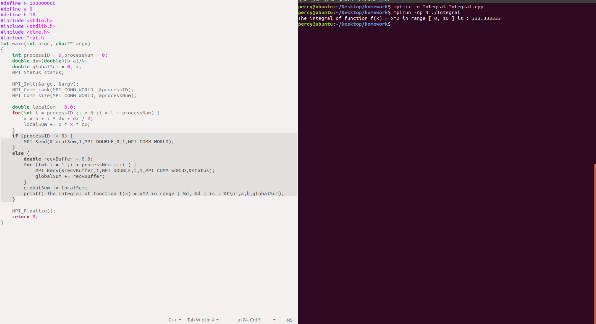

# Experiment 1

### Calculating PI using Monte Carlo Algorithm

#### Notice

The pseudo code of calculating PI has the following problems:

1. Missing `<time.h>`.
2. After MPI_Init, every processor set the same random seed, so they generated the same random sequence, which is not random when comparing between them.
3. Unused variables like `n`, `namelen`.
4. The readability is terrible. Variables are stated far away from where they are used, and are given names without meaning, like `p`, `m`, `n`, `m1`.

In parallel to the problems above, I have changed the code format in the following aspects:

1. #include <time.h>.
2. Set different random seeds for different processers.
3. Removed unused variables.
4. Renamed all variables using small hump rule and restated near usage.
5. Abstracted the calculation of `localPI` into a function.

#### Source Code

```c++
#include "mpi.h"
#include <stdio.h>
#include <stdlib.h>
#include <time.h>
#define THROW_COUNT 1000000
double getLocalPI()
{
    double localPI = 0.0;
    long inCircle = 0;
    for(int i=0;i<THROW_COUNT;++i)
    {
        double x = (double)rand()/(double)RAND_MAX;
        double y = (double)rand()/(double)RAND_MAX;
        if((x-0.5)*(x-0.5)+(y-0.5)*(y-0.5)<0.25) {
            ++inCircle;
        }
    }
    localPI = 4.0*inCircle/THROW_COUNT;
    return localPI;
}

int main(int argc,char **argv)
{ 
    int processID = 0, processNum = 0;
    double globalPI = 0.0;
    int nameLen = 0;
    char processorName[MPI_MAX_PROCESSOR_NAME];
    MPI_Init(&argc,&argv);
    MPI_Comm_rank(MPI_COMM_WORLD,&processID);
    MPI_Comm_size(MPI_COMM_WORLD,&processNum);
    MPI_Get_processor_name(processorName, &nameLen);
    printf("Process %d of %d is on %s\n",processID,processNum,processorName);
    srand(processID+(int)time(0));
    double localPI = getLocalPI();
    printf("Process %d of %d pi= %f\n", processID, processNum, localPI);
    MPI_Reduce(&localPI, &globalPI, 1, MPI_DOUBLE, MPI_SUM, 0, MPI_COMM_WORLD);
    if (processID == 0) {
        globalPI /= processNum;
        printf("Average value of PI from %d processes: %f\n", processNum, globalPI); 
    }
    MPI_Finalize();
    return 0;
}
```

#### Screen Capture

<left>
    
</left>

### ­Calculating Integral By Brute Force

I also reformatted the pseudo code given.

#### Source Code

```c++
#define N 100000000
#define a 0
#define b 10
#include <stdio.h>
#include <stdlib.h>
#include <time.h>
#include "mpi.h"

int main(int argc, char* argv)
{
    int processID = 0,processNum = 0;
    double dx=(double)(b-a)/N;
    double globalSum = 0, x;
    MPI_Status status;
    int nameLen = 0;
    char processorName[MPI_MAX_PROCESSOR_NAME];
    MPI_Init(&argc, &argv);
    MPI_Comm_rank(MPI_COMM_WORLD, &processID);
    MPI_Comm_size(MPI_COMM_WORLD, &processNum);
    MPI_Get_processor_name(processorName, &nameLen);
    printf("Process %d of %d is on %s\n",processID,processNum,processorName);
    double localSum = 0.0;
    for(int i = processID ;i < N ;i = i + processNum) {
        x = a + i * dx + dx / 2;
        localSum += x * x * dx;
    }
    if (processID != 0) {
        MPI_Send(&localSum,1,MPI_DOUBLE,0,1,MPI_COMM_WORLD);
    }
    else {
        double recvBuffer = 0.0;
        for (int i = 1 ;i < processNum ;++i ) {
            MPI_Recv(&recvBuffer,1,MPI_DOUBLE,i,1,MPI_COMM_WORLD,&status);
            globalSum += recvBuffer;
        }
        globalSum += localSum;
        printf("The integral of function f(x) = x^2 in range [ %d, %d ] is : %f\n",a,b,globalSum);
    }
    MPI_Finalize();
    return 0;
}
```

#### Screen Capture

<left>
    
</left>

### Running in Distributed Mode

<left>
    
</left>

